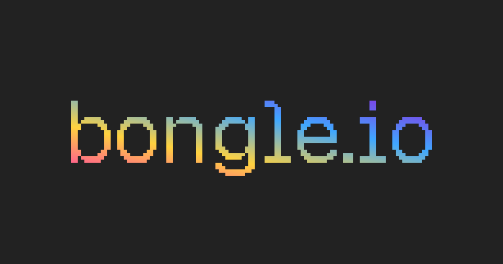

bongle is a multiplayer voxel game engine built for the web.

it powers [bongle.io](https://bongle.io), and is available here as free open source software.

**Features**

- scene editor with client and server hot-module-reload
- asset pipeline for blocks, textures, models, sounds, and sprites
- voxel editing features that should excite WorldEdit fans
- an opinionated voxel world, with APIs that give large creative freedom within it

**Documentation**

- [guide](./docs/docs.md): read top to bottom to learn the engine and its API, with getting started, examples, and guidance.
- [api reference](./docs/api.md): the full public API surface.
- examples for features can be found in [`./examples/`](./examples). go remix a game on [bongle.io](https://bongle.io) for full-game references!